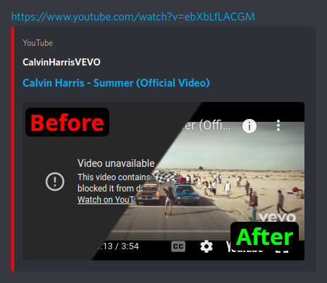

# discord-youtube-embed-fix

## What it does:

Patch YouTube embed links with a proxy, letting you easily play restricted videos within Discord.

## Installation:

1) Install [BetterDiscord](https://betterdiscord.app/) (Note: You are now in violation of TOS!).
2) In Discord, go to Settings->Plugins->Open Plugins Folder.
3) Download [this plugin file](https://raw.githubusercontent.com/nathanfranke/discordytproxy/main/YouTubeProxy.plugin.js).
4) Copy that file to the folder you opened in step 2.
5) Enable the plugin in Discord settings.

**Security Note**: YouTube embeds are shown through a static website proxy, hosted here with GitHub pages. Your Discord client will make a GET request to this server. No personal data is sent or stored with this request. The **YouTube Video ID** is contained in the window fragment (After `#`), which is **not sent to the server**.
